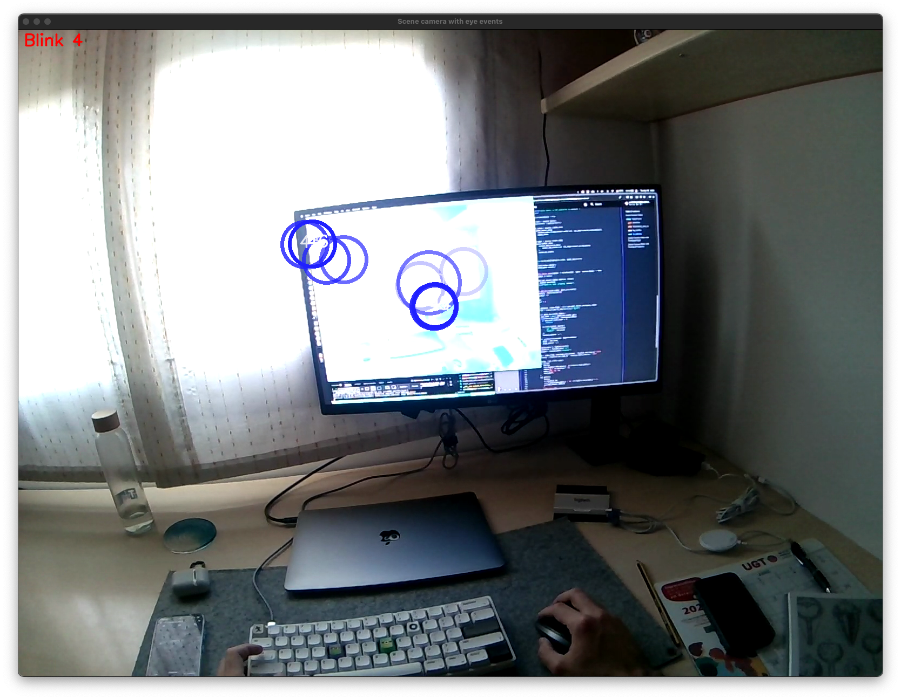

## Scene Camera Video

You can receive the scene camera video stream with timestamps, using the [`receive_video_frames`][pupil_labs.realtime_api.streaming.receive_video_frames] method.

```py linenums="0"
--8<-- "examples/async/stream_scene_camera_video.py:29:32"
```

<figure markdown="span">
{ width=500,loading=lazy }
</figure>

??? quote "VideoFrame"

    ::: pupil_labs.realtime_api.streaming.video.VideoFrame

??? example "Check the whole example code here"

    ```py title="stream_scene_camera_video.py" linenums="1"
    --8<-- "examples/async/stream_scene_camera_video.py"
    ```

## Scene Camera Video with Overlayed Gaze

The following example shows how you can match multiple sensors streams by qeueing (`asyncio.Queue()`) and matching the data.

<figure markdown="span">
{  width=500,loading=lazy }
</figure>

??? example "Check the whole example code here"

    ```py title="stream_video_with_overlayed_gaze.py" linenums="0"
    --8<-- "examples/async/stream_video_with_overlayed_gaze.py"
    ```

## Scene Camera Video with Overlayed Fixations

<!-- badge:product Neon -->
<!-- badge:companion +2.9.0 -->
<!-- badge:version +1.5.0 -->

You can do this with any streams, including eye events (blinks, or fixations data).

<figure markdown="span">
{  width=500,loading=lazy }
</figure>

??? example "Check the whole example code here"

    ```py title="stream_video_with_overlayed_fixations.py" linenums="1"
    --8<-- "examples/async/stream_video_with_overlayed_fixations.py"
    ```
