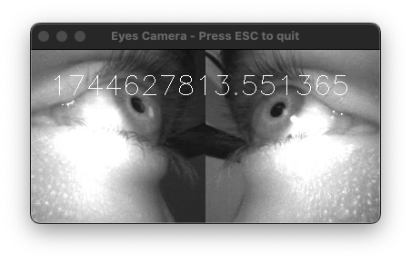

# Stream Eye Cameras

<!-- badge:product Neon -->
<!-- badge:version +1.1.2 -->

You can also receive the eye cameras video stream alone by using the
[`receive_eyes_video_frame`][pupil_labs.realtime_api.simple.Device.receive_eyes_video_frame] method. This might be useful
for developing your own pupil/gaze (or other) detection methodologies.

```py linenums="0"
bgr_pixels, frame_datetime = device.receive_eyes_video_frame()
```

<figure markdown="span">
{ loading=lazy }
</figure>

??? quote "SimpleVideoFrame"

    ::: pupil_labs.realtime_api.simple.SimpleVideoFrame

??? example "Check the whole example code here"

    ```py title="stream_eyes_camera_video.py" linenums="1"
    --8<-- "examples/simple/stream_eyes_camera_video.py"
    ```
