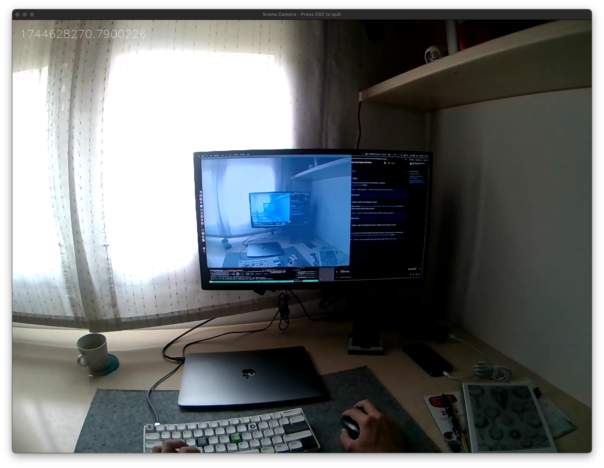
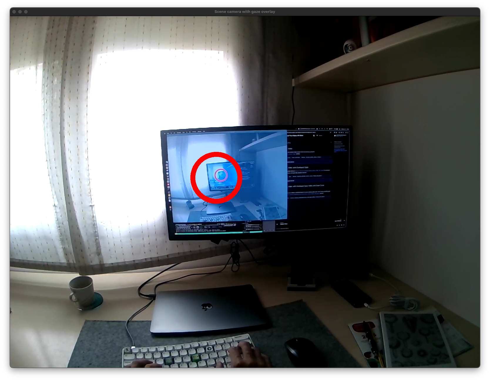

## Scene Camera Video

You can receive the scene camera video stream with timestamps, using the [`device.receive_scene_video_frame`][pupil_labs.realtime_api.simple.Device.receive_scene_video_frame] method.

```py linenums="0"
bgr_pixels, frame_datetime = device.receive_scene_video_frame()
```

<figure markdown="span">
{ width=500,loading=lazy }
</figure>

??? quote "SimpleVideoFrame"

    ::: pupil_labs.realtime_api.simple.SimpleVideoFrame

??? example "Check the whole example code here"

    ```py title="stream_scene_camera_video.py" linenums="1"
    --8<-- "examples/simple/stream_scene_camera_video.py"
    ```

## Scene Camera Video with Overlayed Gaze

We also offer a commodity method ([`device.receive_matched_scene_video_frame_and_gaze`][pupil_labs.realtime_api.simple.Device.receive_matched_scene_video_frame_and_gaze]) to receive a pair of scene camera video and gaze data already matched.

```py linenums="0"
frame, gaze = device.receive_matched_scene_video_frame_and_gaze()
```

<figure markdown="span">
{  width=500,loading=lazy }
</figure>

??? quote "MatchedItem"

    ::: pupil_labs.realtime_api.simple.MatchedItem

??? example "Check the whole example code here"

    ```py title="stream_video_with_overlayed_gaze.py" linenums="1"
    --8<-- "examples/simple/stream_video_with_overlayed_gaze.py"
    ```

## Scene Camera Video with Overlayed Eyes Video and Gaze Circle

<!-- badge:product Neon -->

Simmilarly, on Neon, you can obtain a matched triplet of scene camera video, eyes video frames and the gaze datum, using the [`device.receive_matched_scene_and_eyes_video_frames_and_gaze`][pupil_labs.realtime_api.simple.Device.receive_matched_scene_and_eyes_video_frames_and_gaze] method.

```py linenums="0"
matched = device.receive_matched_scene_and_eyes_video_frames_and_gaze()
```

<figure markdown="span">
{  width=500,loading=lazy }
</figure>

??? quote "MatchedGazeEyesSceneItem"

    ::: pupil_labs.realtime_api.simple.MatchedGazeEyesSceneItem

<!-- ## Scene Camera Video with Overlayed Fixations

<!-- badge:product Neon -->
<!-- badge:companion +2.9.0 -->
<!-- badge:version +1.5.0 -->

Although there is no convenient method to receive a matched scene camera video with fixation data, here is an example of how you can implement it yourself.

??? example "Check the whole example code here"

    ```py title="stream_video_with_overlayed_fixations.py" linenums="1"
    #--8<-- "examples/simple/stream_video_with_overlayed_fixations.py"
    ``` -->
